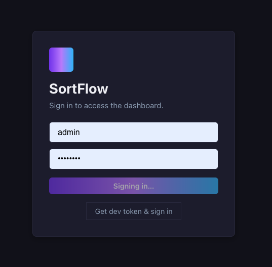
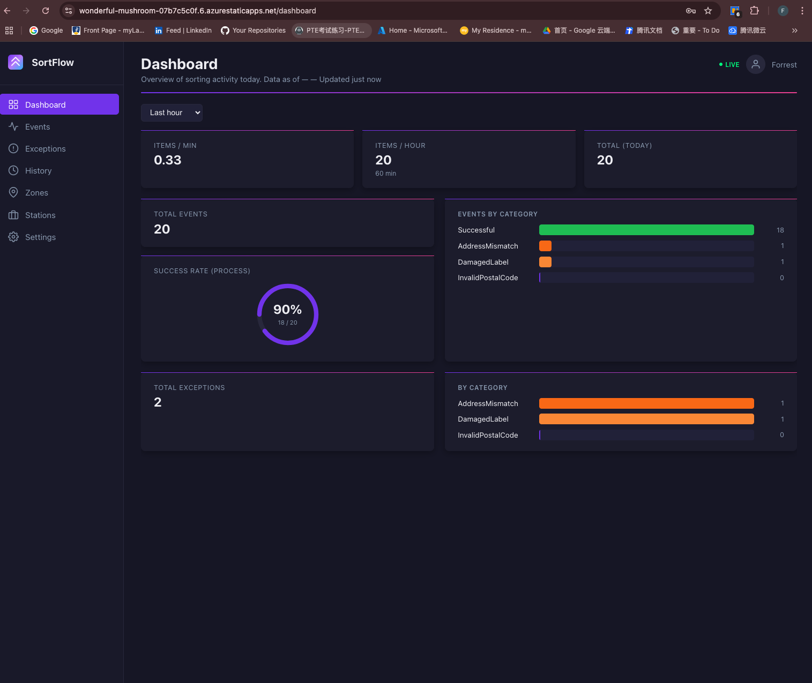
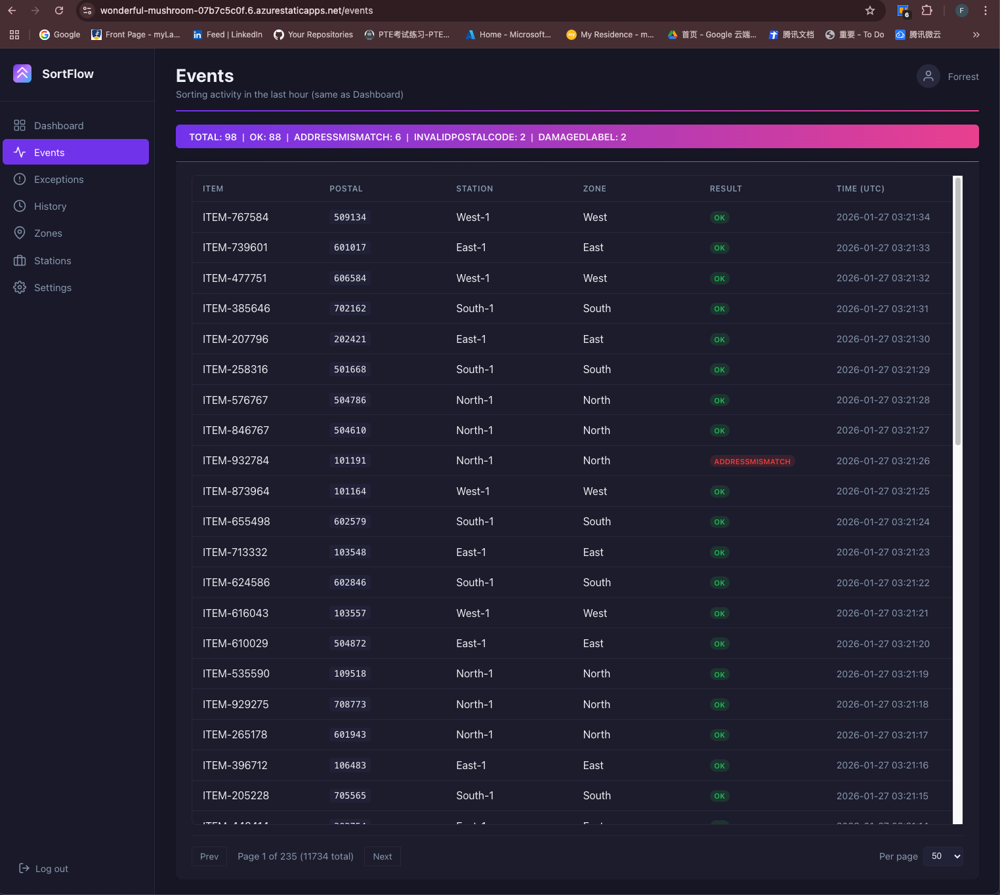
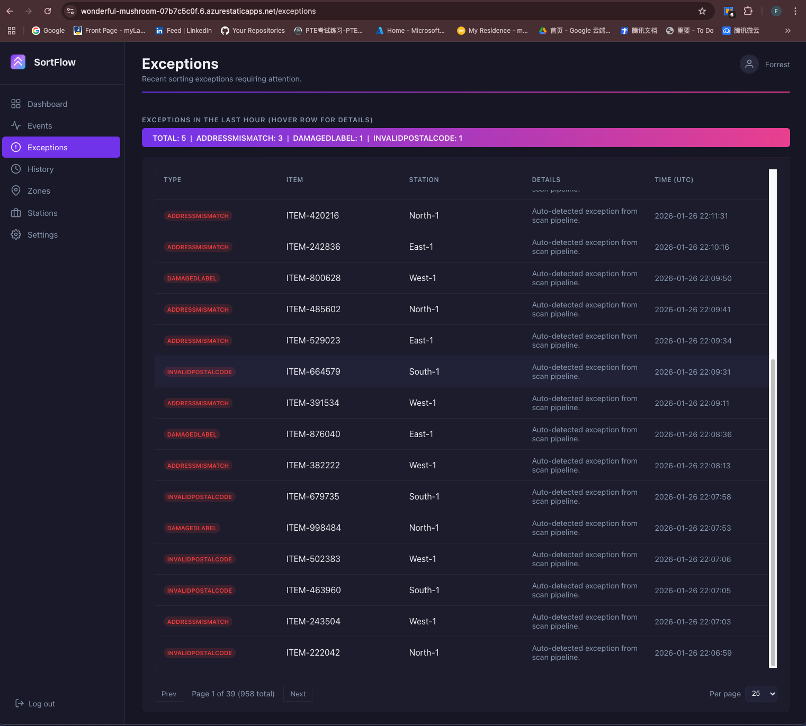
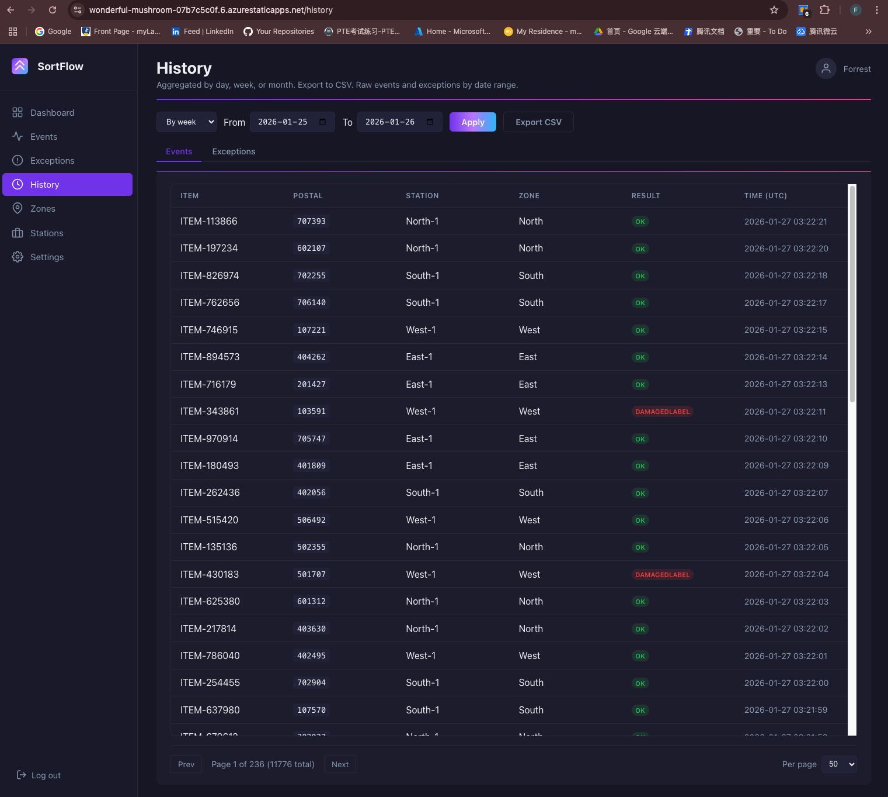
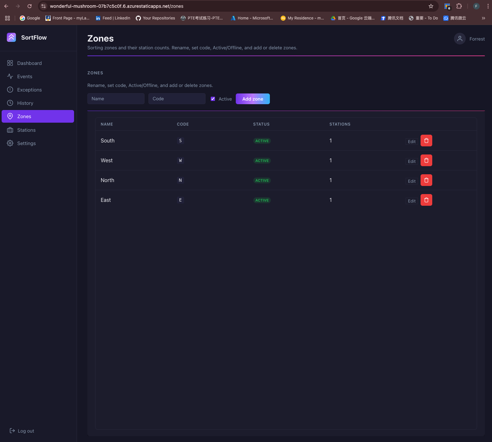
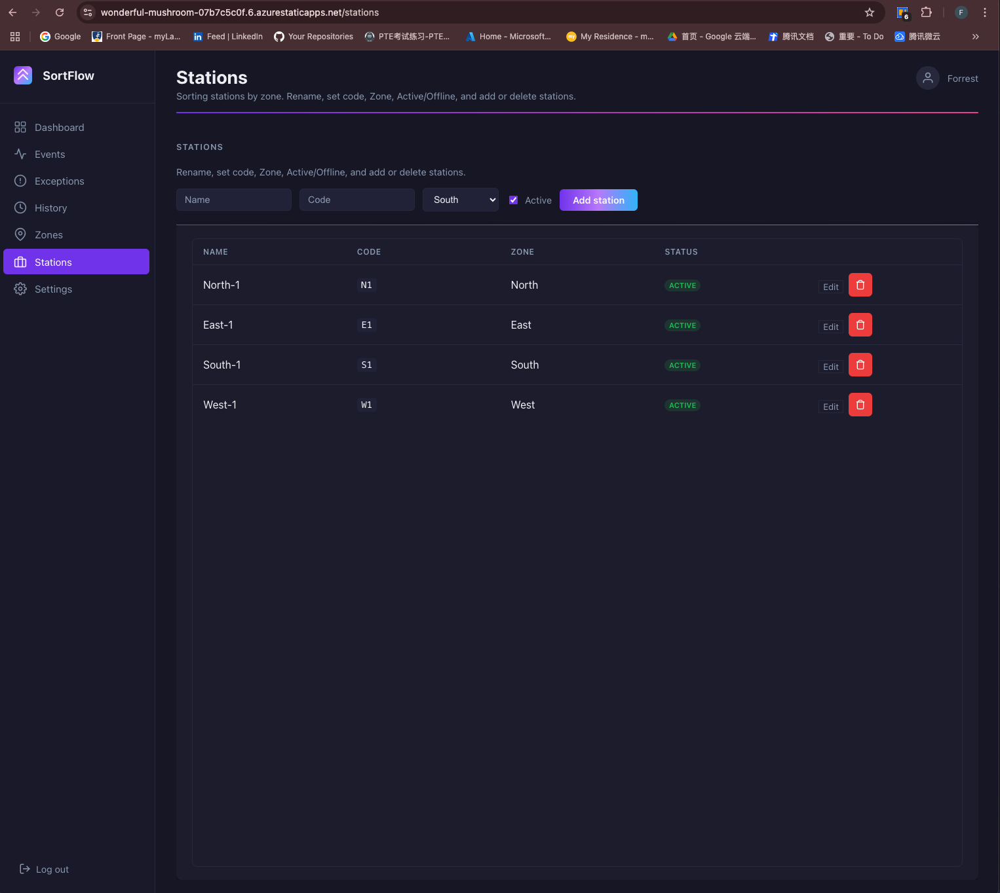
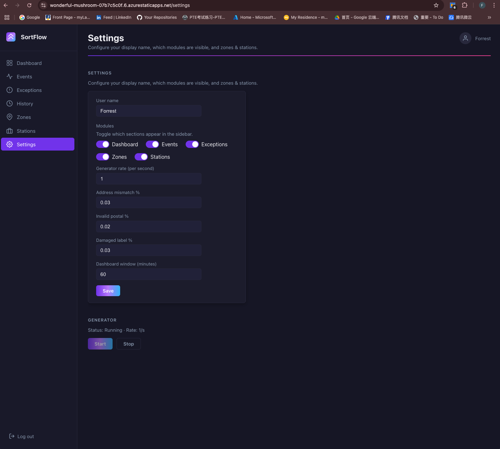

# SortFlow

> Enterprise-ready logistics sorting factory platform with real-time monitoring, configurable event generation, and operational insights.

[](https://dotnet.microsoft.com/)
[](https://react.dev/)
[](https://vitejs.dev/)
[](https://www.postgresql.org/)
[](https://learn.microsoft.com/aspnet/core/signalr)
[](https://www.docker.com/)
[](https://github.com/Forrest-tech/SortFlow/stargazers)
[](https://github.com/Forrest-tech/SortFlow/forks)

## Overview

SortFlow simulates and monitors a high-throughput sorting factory. It provides live operational visibility, audit-ready history, and configuration controls for event rates and exception probabilities. The system is split into a .NET API and a React front-end, with real-time updates pushed via SignalR.

## Screenshots (navigation order)










## Product design

- **Operational dashboard** — live KPIs, category breakdowns, and success rate trends
- **Investigations view** — filterable Events and Exceptions with sticky tables and summaries
- **Historical analytics** — date-range queries, grouped summaries, and CSV export
- **Factory structure** — Zones and Stations CRUD with business rules
- **Runtime controls** — tune generator rates and exception probabilities

## Core functions

- **Real-time updates** via SignalR for dashboard and tables
- **Event/exception ingestion** through a background generator service
- **Configurable settings** that immediately affect generated output
- **Secure access** with JWT login and dev token for local testing

## Popularity

This project currently shows early-stage public adoption on GitHub (low stars/forks). If you want the repo to look more active, consider adding demo screenshots, a short video, and a public roadmap.

## Tech Stack

| Layer         | Technologies |
|---------------|--------------|
| **Backend**   | .NET 8, EF Core 8, Npgsql.EntityFrameworkCore.PostgreSQL 8, JWT, SignalR, Swagger, Serilog, Clean Architecture (Api / Application / Domain / Infrastructure), Migrations |
| **Frontend**  | React 18, Vite 5, TypeScript 5.6, React Router 6, @microsoft/signalr 8 |
| **Database**  | PostgreSQL 16 |
| **DevOps**    | Docker Compose, GitHub Actions (CI/CD), Azure App Service |

## Run with Docker (recommended)

```bash
cd sortflow-api
docker compose up -d
```

- **API:** http://localhost:5000 (Swagger: /swagger)
- **PostgreSQL:** `localhost:5432`, database `sortflow`, user `sortflow`, password `sortflow_pw`

Then run the web app:

```bash
cd sortflow-web
npm install && npm run dev
```

→ http://localhost:3000 — Sign in (e.g. dev/dev or **Get dev token**).

## Run locally (without Docker)

1. **PostgreSQL** — Running at `localhost:5432`. Create database `sortflow` and user/password (e.g. `sortflow` / `sortflow_pw`). Set `ConnectionStrings:SortFlowDb` in `appsettings.json` or use env `SortFlowDb`. EF DesignTimeDbContextFactory uses `SortFlowDb` or `Host=localhost;Port=5432;Database=sortflow;Username=sortflow;Password=sortflow_pw`.

2. **API**
   ```bash
   cd sortflow-api
   dotnet run --project src/SortFlow.Api
   ```
   Migrations and seed (Zones, Stations, AppSettings) run on startup.

3. **Web**
   ```bash
   cd sortflow-web
   npm install && npm run dev
   ```

## Project structure

| Folder           | Description |
|------------------|-------------|
| **sortflow-api** | .NET 8 solution: **SortFlow.Api** (Controllers, Hubs, Middleware, Services), **SortFlow.Application** (Abstractions, Services, Models), **SortFlow.Domain** (Entities, Enums), **SortFlow.Infrastructure** (DbContext, Repositories, Migrations, DataSeeder, DesignTimeDbContextFactory). Dockerfile, docker-compose. |
| **sortflow-web** | Vite + React: `src/pages` (Dashboard, Events, Exceptions, History, Zones, Stations, Settings, Login), `src/components`, `src/hooks`, `src/api`. |

## API overview

| Method | Path | Description |
|--------|------|-------------|
| `POST` | `/api/auth/login` | JWT (body: `username`, `password`) |
| `POST` | `/api/auth/token` | Dev JWT (Development only) |
| `GET`  | `/api/dashboard/summary` | `?windowMinutes=`, `timeFrom`, `timeTo`; returns `eventsByCategory` (OK, InvalidPostalCode, DamagedLabel, AddressMismatch) |
| `GET`  | `/api/events` | `page`, `pageSize` (1–200), `sortBy`, `sortDir`, `zoneId`, `stationId`, `timeFrom`, `timeTo`, `exceptionType`, `result` |
| `GET`  | `/api/exceptions` | Same query params as events (no `result`) |
| `GET`  | `/api/history` | `?groupBy=day|week|month`, `from`, `to` (aggregated) |
| `GET`  | `/api/history/export` | CSV; `from`, `to` |
| `GET/PUT` | `/api/settings` | AppSettings |
| `GET/POST/PUT/DELETE` | `/api/zones` | CRUD |
| `GET/POST/PUT/DELETE` | `/api/stations` | CRUD |
| `POST` | `/api/admin/generator/start` | Start generator |
| `POST` | `/api/admin/generator/stop` | Stop generator |
| `GET`  | `/api/admin/generator/status` | `isRunning`, `ratePerSecond` |
| `GET`  | `/health` | Health check |
| SignalR | `/hubs/dashboard` | `sortingEventReceived`, `dashboard:summaryUpdated`, `events:newBatch`, `exceptions:newBatch` |

## Configuration

- **API:** `sortflow-api/src/SortFlow.Api/appsettings.json`
  - `ConnectionStrings:SortFlowDb`
  - `Jwt:Key` (≥32 chars), `Issuer`, `Audience`
  - `Cors:AllowedOrigins`
  - `Serilog` (e.g. MinimumLevel, WriteTo)

- **Web:** `sortflow-web/src/api/client.ts` — `API_BASE` from `VITE_API_BASE` or default `http://localhost:5000`.

## Deploy to Azure

1. Create an **Azure App Service** (e.g. Linux, .NET 8).
2. Add **Application settings** (or Key Vault):
   - `ConnectionStrings__SortFlowDb` — Azure PostgreSQL or managed instance connection string
   - `Jwt__Key` — ≥32-character secret
   - `Cors__AllowedOrigins` — e.g. `https://yourfrontend.azurestaticapps.net`
3. Run **migrations** on first deploy (startup runs `Migrate()` and seed, or run `dotnet ef database update` from the API project against the production DB).
4. **GitHub Actions:** CD workflow (`cd.yml`) publishes `sortflow-api/src/SortFlow.Api/SortFlow.Api.csproj` and deploys to Azure. Configure secrets: `AZURE_WEBAPP_NAME`, `AZURE_WEBAPP_PUBLISH_PROFILE` (and optionally `AZURE_CREDENTIALS` for `azure/login@v2`).

## CI / CD

- **CI** (`ci.yml`): on push/PR to `main` — `dotnet restore/build/test` for `sortflow-api/SortFlow.sln`, `npm ci` and `npm run build` for `sortflow-web`.
- **CD** (`cd.yml`): on push to `main` — build and deploy API to Azure App Service.

## Security

Use **User Secrets** or environment variables for production; do not commit `Jwt:Key` or DB passwords.
